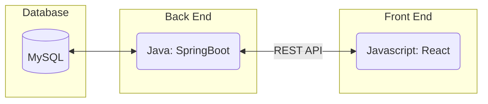

# Star Stalker

A real-time NBA team flight tracker using live ADS-B flight data.

## How It Works

Sports teams fly charter flights with consistent, predictable callsigns. Star Stalker polls the [Airplanes.live REST API](http://api.airplanes.live/v2/) for real-time position data for each NBA team, stores it in MySQL, and serves it to a React frontend. If a team is not currently flying, the last known position is preserved.

## Technology Stack



---

## Local Setup

### Prerequisites

- Docker and Docker Compose
- Node.js 18+ and npm (for frontend development only)
- Java 21 and Gradle (for backend development only)

### 1. Configure environment

Copy the local environment template and fill in your values:

```bash
cp .env.local.example .env.local
```

The `.env.local.example` file contains:

```
DB_HOST=mysql
DB_PORT=3306
DB_NAME=nba_flight_tracker
DB_USER=flight_user
DB_PASSWORD=dev_password_change_me
```

### 2. Start all services (Docker)

```bash
docker compose --env-file .env.local -f docker-compose.yml -f docker-compose.local.yml up -d --build
```

| Service | URL |
|---------|-----|
| Backend API | http://localhost:8080 |
| Frontend | http://localhost:3000 |
| MySQL | localhost:3306 |

---

## Running Without Docker

### Backend only

```bash
cd backend
./gradlew bootRun
```

Requires a running MySQL instance configured via `application.properties` or environment variables.

### Frontend only

```bash
cd frontend
npm install
npm start
```

Runs at `http://localhost:3000` and proxies API calls to `http://localhost:8080`. See [`frontend/README.md`](frontend/README.md) for environment variable options.

---

## Running Tests

### Backend (JUnit via Gradle)

```bash
cd backend
./gradlew test
```

Test reports are written to `backend/build/reports/tests/`.

### Frontend (Jest via npm)

```bash
cd frontend
npm test -- --ci --watch=false
```

---

## CI/CD Pipeline

The GitLab CI pipeline (`.gitlab-ci.yml`) runs four stages on every push:

| Stage | Jobs | Notes |
|-------|------|-------|
| **lint** | `lint_backend` (Gradle check), `lint_frontend` (ESLint) | Frontend lint failures are non-blocking while rules are finalized |
| **test** | `test_backend` (JUnit), `test_frontend` (Jest) | Frontend test failures are non-blocking |
| **build** | `build_backend` (Gradle bootJar), `build_frontend` (npm build) | Artifacts kept for 1 week |
| **deploy** | `deploy_to_vm` | Runs on `main` only — SSH into GCE VM and runs `docker compose up -d --build` |

**Required CI variables** (set in GitLab project settings):

| Variable | Description |
|----------|-------------|
| `VM_HOST` | GCE VM hostname or IP |
| `VM_USER` | SSH username |
| `VM_SSH_KEY` | Private SSH key (protected, masked) |

---

## Project Structure

```
backend/      Spring Boot app (Java 21, Gradle)
frontend/     React app (Node 18+)
database/     Flyway migration scripts and SQL utilities
docs/         Developer guides (GCP access, Flyway rollback)
scripts/      Utility scripts
```

---

## Further Documentation

| Doc | Description |
|-----|-------------|
| [`API.md`](API.md) | Ingestion API endpoints, scheduling, and logs |
| [`frontend/README.md`](frontend/README.md) | Frontend features, structure, and env vars |
| [`database/README.md`](database/README.md) | MySQL connection and useful queries |
| [`database/DATABASE_DOCUMENTAION.md`](database/DATABASE_DOCUMENTAION.md) | Full schema: tables, views, stored procedures |
| [`docs/DEVELOPER_ACCESS.md`](docs/DEVELOPER_ACCESS.md) | GCP VM access |
| [`docs/FLYWAY_ROLLBACK.md`](docs/FLYWAY_ROLLBACK.md) | Database migration rollback strategy |
| [`STYLE.md`](STYLE.md) | Naming, formatting, git, and testing conventions |
